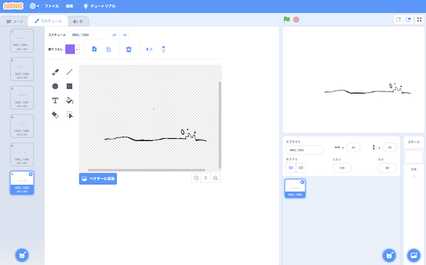
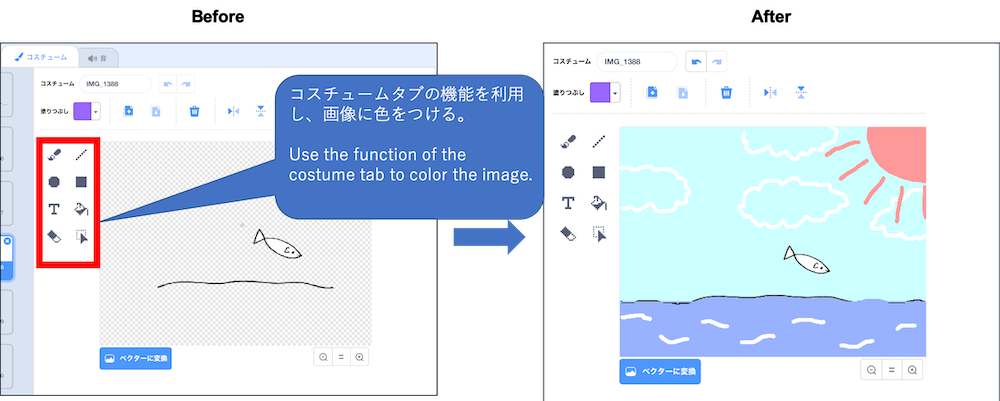

# はじめに(Introduction)

このドキュメントでは、[Scratch 3.0](https://scratch.mit.edu/download)を使ったアニメーションの作成方法を説明します。

This document describes how to create animations using [Scratch 3.0](https://scratch.mit.edu/download).

ドキュメント作成者：神長 貴博(NTTテクノクロス株式会社)

Document Author：Takahiro Jincho(NTT TechnoCross Corporation)

# 準備①:開発環境(Preparation ①:Development environment)

- [Scratch公式サイト(https://scratch.mit.edu/download)](https://scratch.mit.edu/download)から、Scratch 3.0をダウンロード、インストールする。(Scratch 3.0は、Windows、macOS、chromeOS、Androidに対応。(2020/03/23時点))

    Download and install Scratch 3.0 from the [Scratch official website(https://scratch.mit.edu/download)](https://scratch.mit.edu/download).(Scratch 3.0 is compatible with Windows, macOS, chromeOS, Android. (As of 2020/03/23))

# 準備②：アニメーションの素材を作る(Preparation ②:Create Animation Material)

- A5サイズ(148×210mm)の紙を6枚用意する。

    Prepare 6 sheets of A5 size paper (148 x 210 mm).

- 1〜6の順番でアニメーションするように絵を描く。

    Draw a picture to animate in the order of 1-6.

- 絵をカメラアプリで撮影する。(この例では、 **[『Adobe Illustrator Draw』](https://apps.apple.com/jp/app/adobe-illustrator-draw/id911156590)** と **『[Adobe Capture](https://apps.apple.com/jp/app/adobe-capture/id1040200189)』** を使用。)

    Take a picture with a camera app.(This example uses **[『Adobe Illustrator Draw』](https://apps.apple.com/jp/app/adobe-illustrator-draw/id911156590)** and **『[Adobe Capture](https://apps.apple.com/jp/app/adobe-capture/id1040200189)』**.)

- カメラアプリで撮影した画像をScratch 3.0がインストールされたPCに保存する。

    Save the images taken with the camera app to a PC with Scratch 3.0 installed.

# 準備③：プロジェクトの作成(Preparation ③:Make Project)

- Scratch 3.0を起動し、スプライト1を削除する。(スプライト1を選択→×をクリック)

    Start Scratch 3.0 and delete sprite 1.(Select sprite 1　→　Click ×)

- **『スプライトをアップロード』** をクリックし、カメラアプリで撮影した画像を選択する。

    Click Upload Sprite and select the image taken with the camera app.

- スプライトが設定されていることを確認する。

    Confirm that the selected sprite is set.

- **『コスチュームをアップロード』** をクリックし、カメラアプリで撮影した画像を選択する。(準備した6枚の画像分、この手順を行う)

    Click Upload Costume and select the image taken with the camera app.(Do this procedure for the six prepared images.)

- コスチュームが設定されていることを確認する。

    Confirm that the selected costume is set.

- ボタンをクリックし、効果のカテゴリから、 **『Zoop』** 、 **『Water drop』** を選択する。

    Click the button and select **『Zoop』** and **『Water drop』** from the effects category.

- 選んだ音が、設定されていることを確認する。

    Confirm that the selected sound is set.

# アニメーションの作り方(How to make animation)

- 以下の図のとおり、カテゴリ毎のブロックをドラッグ＆ドロップし、ブロック同士をつなげる。

    As shown in the figure below, drag and drop blocks for each category to connect the blocks.

- ブロックの白枠をクリックし、50から1に変更する。

    Click the white frame of the block and change it from 50 to 1.

- ブロックの白枠をクリックし、50から5に変更する。

    Click the white frame of the block and change it from 50 to 5.

- Zoopの右側にある▼ボタンを押し、音をWater Dropに変更する。

    Press the ▼ button on the right side of Zoop to change the sound to a Water Drop.

- ブロックの白枠をクリックし、1から0.1に変更する。

    Click the white frame of the block and change it from 1 to 0.1.

- ボタンを押し、プログラムが動くことを確認する。

    Press the  button and confirm that the program runs.

- ボタンを押し、プログラムが止まることを確認する。

    Press the  button and confirm that the program stops.

# 付録：変更例(Appendix：Modification Example )

コスチュームタブの機能を利用し、画像に色をつけることで、アニメーションがより良くなります。

Use the Costume Tab feature to color the images for cooler animation.

